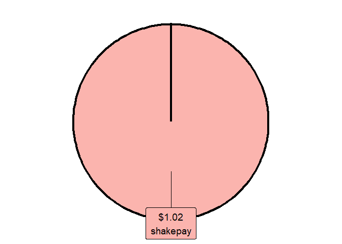
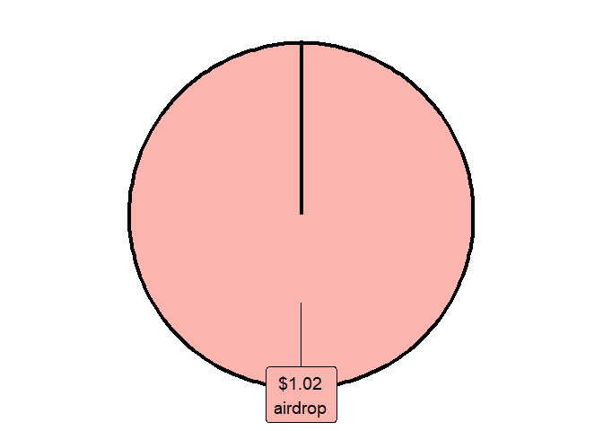

<!-- README.md is generated from README.Rmd. Please edit that file -->

# cryptoTax: Crypto taxes in R (Canada only) 

*Disclaimer: This is not financial advice. Use at your own risks. There
are no guarantees whatsoever in relation to the use of this package.
Please consult a tax professional as necessary*.

Helps calculate crypto taxes in R.

1.  First, by allowing you to format .CSV files from various exchanges
    to one large dataframe of organized transactions.
2.  Second, by allowing you to calculate your Adjusted Cost Base (ACB),
    ACB per share, and realized and unrealized capital gains/losses.
3.  Third, by calculating revenues gained from staking, interest,
    airdrops, etc.
4.  Fourth, by calculating superficial losses as well, if desired.

Only supports basic or simple tax scenarios (for now).

# Installation

To install, use:

``` r
remotes::install_github("cryptoltruist/cryptoTax")
```

# ACB demo

``` r
library(cryptoTax)
data <- adjustedcostbase.ca_1
data
#>         date transaction quantity price fees
#> 1 2014-03-03         buy      100    50   10
#> 2 2014-05-01        sell       50   120   10
#> 3 2014-07-18         buy       50   130   10
#> 4 2014-09-25        sell       40    90   10
ACB(data, spot.rate = "price", sup.loss = FALSE)
#>         date transaction quantity price fees total.price total.quantity  ACB
#> 1 2014-03-03         buy      100    50   10        5000            100 5010
#> 2 2014-05-01        sell       50   120   10        6000             50 2505
#> 3 2014-07-18         buy       50   130   10        6500            100 9015
#> 4 2014-09-25        sell       40    90   10        3600             60 5409
#>   ACB.share gains
#> 1     50.10    NA
#> 2     50.10  3485
#> 3     90.15    NA
#> 4     90.15   -16
```

# Workflow demo

``` r

# Prepare list of coins
my.coins <- c("BTC", "CRO", "ETH")

list.prices <- prepare_list_prices(coins = my.coins, start.date = "2021-01-01")
#> ❯ Scraping historical crypto data
#> 
#> ❯ Processing historical crypto data
#> 

# Load data
data(shakepay)
# Format file
(formatted.shakepay <- format_shakepay(shakepay))
#>                  date   quantity currency total.price spot.rate transaction
#> 1 2021-04-07 14:50:41 0.00103982      BTC  53.0333500  51002.43         buy
#> 2 2021-04-08 12:12:57 0.00000480      BTC   0.2523938  52582.03     revenue
#> 3 2021-04-08 12:22:07 0.00000300      BTC   0.1508610  50287.01     revenue
#> 4 2021-04-10 12:47:14 0.00000330      BTC   0.1865411  56527.62     revenue
#> 5 2021-04-11 12:03:31 0.00000350      BTC   0.2099232  59978.05     revenue
#> 6 2021-04-11 12:21:49 0.00000380      BTC   0.2207769  58099.18     revenue
#> 7 2021-04-25 00:52:19 0.00052991      BTC  31.2684800  59007.15        sell
#>     description  comment revenue.type fees exchange rate.source
#> 1 purchase/sale purchase         <NA>    0 shakepay    exchange
#> 2   shakingsats   credit      airdrop    0 shakepay    exchange
#> 3   shakingsats   credit      airdrop    0 shakepay    exchange
#> 4   shakingsats   credit      airdrop    0 shakepay    exchange
#> 5   shakingsats   credit      airdrop    0 shakepay    exchange
#> 6   shakingsats   credit      airdrop    0 shakepay    exchange
#> 7 purchase/sale     sale         <NA>    0 shakepay    exchange

all.data <- merge_exchanges(formatted.shakepay)

formatted.ACB <- format_ACB(all.data)
#> Process started at 2023-01-05 12:44:52. Please be patient as the transactions process.
#> [Formatting ACB (progress bar repeats for each coin)...]
#> Warning in format_ACB(all.data): WARNING: Adjusted cost base (ACB) and capital
#> gains have been adjusted for the superficial loss rule. To avoid adjusting for
#> the superficial loss rule, this, use argument `sup.loss = FALSE`.
#> Process ended at 2023-01-05 12:44:53. Total time elapsed: 0.42 minutes

as.data.frame(formatted.ACB)
#>                  date currency   quantity total.price spot.rate transaction
#> 1 2021-04-07 14:50:41      BTC 0.00103982    53.03335  51002.43         buy
#> 2 2021-04-08 12:12:57      BTC 0.00000480     0.00000  52582.03     revenue
#> 3 2021-04-08 12:22:07      BTC 0.00000300     0.00000  50287.01     revenue
#> 4 2021-04-10 12:47:14      BTC 0.00000330     0.00000  56527.62     revenue
#> 5 2021-04-11 12:03:31      BTC 0.00000350     0.00000  59978.05     revenue
#> 6 2021-04-11 12:21:49      BTC 0.00000380     0.00000  58099.18     revenue
#> 7 2021-04-25 00:52:19      BTC 0.00052991    31.26848  59007.15        sell
#>   fees   description  comment revenue.type      value exchange rate.source
#> 1    0 purchase/sale purchase         <NA> 53.0333500 shakepay    exchange
#> 2    0   shakingsats   credit      airdrop  0.2523938 shakepay    exchange
#> 3    0   shakingsats   credit      airdrop  0.1508610 shakepay    exchange
#> 4    0   shakingsats   credit      airdrop  0.1865411 shakepay    exchange
#> 5    0   shakingsats   credit      airdrop  0.2099232 shakepay    exchange
#> 6    0   shakingsats   credit      airdrop  0.2207769 shakepay    exchange
#> 7    0 purchase/sale     sale         <NA> 31.2684800 shakepay    exchange
#>   currency2 total.quantity                                    suploss.range
#> 1       BTC     0.00103982 2021-03-08 14:50:41 UTC--2021-05-07 14:50:41 UTC
#> 2       BTC     0.00104462 2021-03-09 12:12:57 UTC--2021-05-08 12:12:57 UTC
#> 3       BTC     0.00104762 2021-03-09 12:22:07 UTC--2021-05-08 12:22:07 UTC
#> 4       BTC     0.00105092 2021-03-11 12:47:14 UTC--2021-05-10 12:47:14 UTC
#> 5       BTC     0.00105442 2021-03-12 12:03:31 UTC--2021-05-11 12:03:31 UTC
#> 6       BTC     0.00105822 2021-03-12 12:21:49 UTC--2021-05-11 12:21:49 UTC
#> 7       BTC     0.00052831 2021-03-26 00:52:19 UTC--2021-05-25 00:52:19 UTC
#>   quantity.60days share.left60 sup.loss.quantity sup.loss gains.uncorrected
#> 1      0.00103982   0.00052831        0.00000000    FALSE          0.000000
#> 2      0.00103982   0.00052831        0.00000000    FALSE          0.000000
#> 3      0.00103982   0.00052831        0.00000000    FALSE          0.000000
#> 4      0.00103982   0.00052831        0.00000000    FALSE          0.000000
#> 5      0.00103982   0.00052831        0.00000000    FALSE          0.000000
#> 6      0.00103982   0.00052831        0.00000000    FALSE          0.000000
#> 7      0.00103982   0.00052831        0.00052991    FALSE          4.711713
#>   gains.sup gains.excess    gains      ACB ACB.share
#> 1        NA           NA       NA 53.03335  51002.43
#> 2        NA           NA       NA 53.03335  50768.08
#> 3        NA           NA       NA 53.03335  50622.70
#> 4        NA           NA       NA 53.03335  50463.74
#> 5        NA           NA       NA 53.03335  50296.23
#> 6        NA           NA       NA 53.03335  50115.62
#> 7        NA           NA 4.711713 26.47658  50115.62

# Get latest ACB.share for each coin (ACB)
report_overview(formatted.ACB,
  today.data = TRUE, tax.year = "2021",
  local.timezone = "America/Toronto"
)
#> Warning in report_overview(formatted.ACB, today.data = TRUE, tax.year =
#> "2021", : gains, losses, and net have been filtered for tax year 2021
#>             date.last currency total.quantity cost.share total.cost gains
#> 1 2021-04-25 00:52:19      BTC     0.00052831   50115.62      26.48  4.71
#> 2 2021-04-25 00:52:19    Total             NA         NA      26.48  4.71
#>   losses  net rate.today value.today unrealized.gains unrealized.losses
#> 1      0 4.71   22774.35       12.03               NA            -14.45
#> 2      0 4.71         NA       12.03                0            -14.45
#>   unrealized.net currency2
#> 1         -14.45       BTC
#> 2         -14.45     Total

# Get summary of realized capital gains and losses
report_summary(formatted.ACB,
  today.data = TRUE, tax.year = "2021",
  local.timezone = "America/Toronto"
)
#> Warning in report_summary(formatted.ACB, today.data = TRUE, tax.year = "2021", :
#> gains, losses, and net have been filtered for tax year 2021 (time zone =
#> America/Toronto)
#>                 Type  Amount currency
#> 1           tax.year    2021      CAD
#> 2              gains    4.71      CAD
#> 3             losses    0.00      CAD
#> 4                net    4.71      CAD
#> 5         total.cost   26.48      CAD
#> 6        value.today   12.03      CAD
#> 7   unrealized.gains    0.00      CAD
#> 8  unrealized.losses  -14.45      CAD
#> 9     unrealized.net  -14.45      CAD
#> 10     percentage.up -54.56%      CAD
#> 11       all.time.up -36.77%      CAD

table.revenues <- report_revenues(formatted.ACB, tax.year = "2021")
#> Warning in report_revenues(formatted.ACB, tax.year = "2021"): revenues have been
#> filtered for tax year 2021
#> Adding missing grouping variables: `exchange`
table.revenues
#>   exchange           date.last total.revenues  airdrop referrals staking promo
#> 1 shakepay 2021-04-11 12:21:49           1.02 1.020496         0       0     0
#> 2    total 2021-04-11 12:21:49           1.02 1.020496         0       0     0
#>   interests rebate rewards currency
#> 1         0      0       0      CAD
#> 2         0      0       0      CAD

# Plot revenues by exchange
crypto_pie(table.revenues)
```

<!-- -->

``` r

# Plot revenues by reward type
crypto_pie(table.revenues, by = "revenue.type")
```

<!-- -->

*Disclaimer: This is not financial advice. Use at your own risks. There
are no guarantees whatsoever in relation to the use of this package.
Please consult a tax professional as necessary*.
