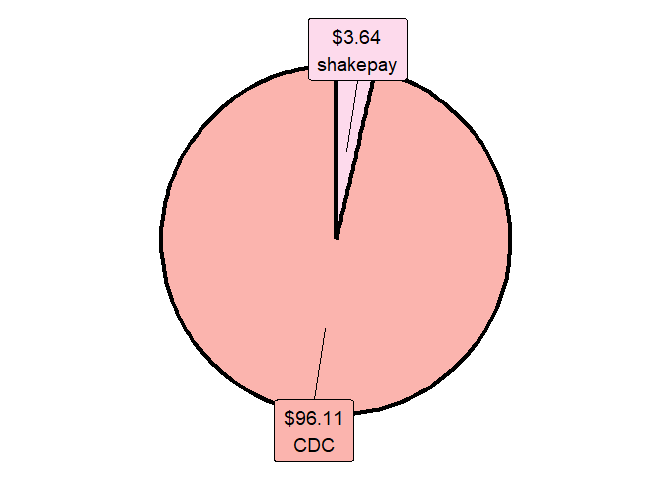
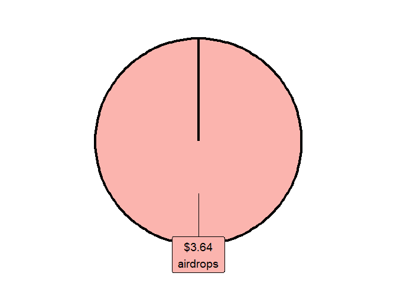

<!-- README.md is generated from README.Rmd. Please edit that file -->
<!-- badges: start -->

[](https://github.com/cryptoltruist/cryptoTax/actions/workflows/R-CMD-check.yaml)
[](https://app.codecov.io/gh/cryptoltruist/cryptoTax?branch=main)
<!-- badges: end -->

# cryptoTax: Crypto taxes in R (Canada only) 

*Disclaimer: This is not financial advice. Use at your own risks. There
are no guarantees whatsoever in relation to the use of this package.
Please consult a tax professional as necessary*.

------------------------------------------------------------------------

Helps calculate crypto taxes in R.

1.  First, by allowing you to format .CSV files from various exchanges
    to one large dataframe of organized transactions.
2.  Second, by allowing you to calculate your Adjusted Cost Base (ACB),
    ACB per share, and realized and unrealized capital gains/losses.
3.  Third, by calculating revenues gained from staking, interest,
    airdrops, etc.
4.  Fourth, by calculating superficial losses as well, if desired.

This is a work in progress. If you notice bugs, please report them:
<https://github.com/cryptoltruist/cryptoTax/issues>.

## Recommended workflow

For most users, the modern happy path is:

1.  Format one or more exchange exports with `format_exchanges()`
2.  Match or supply prices explicitly with bundled or cached `list.prices`
3.  Run `format_ACB()` on the normalized transaction table
4.  Generate summaries and reports from the formatted ACB output

The package now works best when you pass explicit price inputs for
offline and reproducible workflows.

## Scope note

`cryptoTax` currently implements capital-account style ACB, capital
gain/loss, and superficial-loss mechanics.

It does **not** decide whether your facts should instead be reported as
business income, and it does not automatically decide difficult
"identical property" questions across distinct crypto instruments such
as wrapped, bridged, or staked variants.

Those cases still need judgment outside the raw transaction math.

# Why use `cryptoTax`?

What are the benefits of using an R package to do your crypto taxes as
opposed to an online commercial software?

1.  Full transparency on algorithms (open code)
2.  You stay in control of your data (no need to upload it on another
    platform)
3.  You can reuse your script (no need to start from scratch every year)
4.  No limit on the number of transactions
5.  Easy to automatically recategorize transactions as desired
6.  Unlimited flexibility thanks to the power of R
7.  The community can contribute for continuous improvement and feature
    requests
8.  Easy to export a csv or excel file from all formatted transactions
9.  It is free

# Installation

To install, use:

``` r
remotes::install_github("cryptoltruist/cryptoTax")
```

# ACB demo

``` r
library(cryptoTax)
data <- data_adjustedcostbase1
data
```

<div class="kable-table">

| date       | transaction | quantity | price | fees |
|:-----------|:------------|---------:|------:|-----:|
| 2014-03-03 | buy         |      100 |    50 |   10 |
| 2014-05-01 | sell        |       50 |   120 |   10 |
| 2014-07-18 | buy         |       50 |   130 |   10 |
| 2014-09-25 | sell        |       40 |    90 |   10 |

</div>

``` r
ACB(data, spot.rate = "price", sup.loss = FALSE)
```

<div class="kable-table">

| date       | transaction | quantity | price | fees | total.price | total.quantity |  ACB | ACB.share | gains |
|:-----------|:------------|---------:|------:|-----:|------------:|---------------:|-----:|----------:|------:|
| 2014-03-03 | buy         |      100 |    50 |   10 |        5000 |            100 | 5010 |     50.10 |    NA |
| 2014-05-01 | sell        |       50 |   120 |   10 |        6000 |             50 | 2505 |     50.10 |  3485 |
| 2014-07-18 | buy         |       50 |   130 |   10 |        6500 |            100 | 9015 |     90.15 |    NA |
| 2014-09-25 | sell        |       40 |    90 |   10 |        3600 |             60 | 5409 |     90.15 |   -16 |

</div>

For more on calculating the ACB, as well as superficial losses, see the
[corresponding
vignette](https://cryptoltruist.github.io/cryptoTax/articles/ACB.html).

# Supported exchanges

Currently, the following exchanges are supported with the `format_*`
functions, and can also be auto-detected through `format_exchanges()`:

1.  Adalite
2.  Binance
3.  BlockFi
4.  Crypto.com (app, exchange, wallet)
5.  Celsius
6.  CoinSmart
7.  Exodus wallet
8.  Gemini
9.  Newton
10. Pooltool (ADA)
11. Presearch
12. Shakepay
13. Uphold

To support another exchange not listed here, please open an issue. You
can also prepare your own file according to the style of one of those
exchanges and use the corresponding function.

# Workflow demo

``` r
# Use bundled example prices for an offline, reproducible demo
data(list_prices_example)
list.prices <- list_prices_example

# Load data
data(data_shakepay)
data(data_CDC)

# Format one or more exchange files
all.data <- format_exchanges(list(data_shakepay, data_CDC),
  list.prices = list.prices
)

# Format data with ACB
formatted.ACB <- format_ACB(all.data, verbose = FALSE)

# Let's get a preview of the output
as.data.frame(formatted.ACB[c(1, 4, 8, 10, 19, 20), c(1:6, 7:14, 24:26)])
```

<div class="kable-table">

| date                | currency |  quantity | total.price | spot.rate | transaction | fees | description | comment                | revenue.type |     value | exchange | rate.source | currency2 | gains |      ACB | ACB.share |
|:--------------------|:---------|----------:|------------:|----------:|:------------|-----:|:------------|:-----------------------|:-------------|----------:|:---------|:------------|:----------|------:|---------:|----------:|
| 2021-05-07 14:50:41 | BTC      | 0.0010398 |    53.06974 |  51037.43 | buy         |    0 | Buy         | Bought @ CA\$51,002.43 | NA           | 53.069740 | shakepay | exchange    | BTC       |    NA | 53.06974 |  51037.43 |
| 2021-05-21 12:47:14 | BTC      | 0.0000130 |     0.00000 |  56527.62 | revenue     |    0 | Reward      | ShakingSats            | airdrops     |  0.734859 | shakepay | exchange    | BTC       |    NA | 53.06974 |  49329.57 |
| NA                  | NA       |        NA |          NA |        NA | NA          |   NA | NA          | NA                     | NA           |        NA | NA       | NA          | NA        |    NA |       NA |        NA |
| NA                  | NA       |        NA |          NA |        NA | NA          |   NA | NA          | NA                     | NA           |        NA | NA       | NA          | NA        |    NA |       NA |        NA |
| NA                  | NA       |        NA |          NA |        NA | NA          |   NA | NA          | NA                     | NA           |        NA | NA       | NA          | NA        |    NA |       NA |        NA |
| NA                  | NA       |        NA |          NA |        NA | NA          |   NA | NA          | NA                     | NA           |        NA | NA       | NA          | NA        |    NA |       NA |        NA |

</div>

### Summary info

``` r
# Get latest ACB.share for each coin (ACB)
report_overview(formatted.ACB,
  today.data = TRUE, tax.year = "2021",
  local.timezone = "America/Toronto",
  list.prices = list.prices
)
#> gains, losses, and net have been filtered for tax year 2021
#> Date of current prices: 2023-12-31
```

<div class="kable-table">

| date.last           | currency | total.quantity | cost.share | total.cost |  net | gains | losses | rate.today | value.today | unrealized.gains | unrealized.losses | unrealized.net | currency2 |
|:--------------------|:---------|---------------:|-----------:|-----------:|-----:|------:|-------:|-----------:|------------:|-----------------:|------------------:|---------------:|:----------|
| 2021-07-10 00:52:19 | BTC      |      0.0005749 |   48034.74 |      27.62 | 5.81 |  5.81 |      0 |      83290 |       47.88 |            20.26 |                NA |          20.26 | BTC       |
| 2021-07-10 00:52:19 | Total    |             NA |         NA |      27.62 | 5.81 |  5.81 |      0 |         NA |       47.88 |            20.26 |                 0 |          20.26 | Total     |

</div>

``` r

# Get summary of realized capital gains and losses
report_summary(formatted.ACB,
  today.data = TRUE, tax.year = "2021",
  local.timezone = "America/Toronto",
  list.prices = list.prices
)
#> gains, losses, and net have been filtered for tax year 2021 (time zone = America/Toronto)
#> Date of current prices: 2023-12-31
```

<div class="kable-table">

|                     | Type                | Amount  | currency |
|:--------------------|:--------------------|:--------|:---------|
|                     | tax.year            | 2021    | CAD      |
| gains               | gains               | 5.81    | CAD      |
| losses              | losses              | 0.00    | CAD      |
| net                 | net                 | 5.81    | CAD      |
| total.cost          | total.cost          | 27.62   | CAD      |
| value.today         | value.today         | 47.88   | CAD      |
| unrealized.gains    | unrealized.gains    | 20.26   | CAD      |
| unrealized.losses   | unrealized.losses   | 0.00    | CAD      |
| unrealized.net      | unrealized.net      | 20.26   | CAD      |
| percentage.up       | percentage.up       | 73.38%  | CAD      |
| all.time.up         | all.time.up         | 94.43%  | CAD      |
| all.time.up.revenue | all.time.up.revenue | 107.62% | CAD      |
| revenue             | revenue             | 3.64    | CAD      |

</div>

### Revenue estimation

``` r
table.revenues <- report_revenues(formatted.ACB, tax.year = "2021")
#> Note: revenues have been filtered for tax year 2021
table.revenues
```

<div class="kable-table">

| exchange | date.last           | total.revenues | interests | rebates | staking | promos | airdrops | referrals | rewards | forks | mining | currency |
|:---------|:--------------------|---------------:|----------:|--------:|--------:|-------:|---------:|----------:|--------:|------:|-------:|:---------|
| shakepay | 2021-06-23 12:21:49 |           3.64 |         0 |       0 |       0 |      0 |     3.64 |         0 |       0 |     0 |      0 | CAD      |
| total    | 2021-06-23 12:21:49 |           3.64 |         0 |       0 |       0 |      0 |     3.64 |         0 |       0 |     0 |      0 | CAD      |

</div>

``` r

# Plot revenues by exchange
crypto_pie(table.revenues)
```

<!-- -->

``` r

# Plot revenues by reward type
crypto_pie(table.revenues, by = "revenue.type")
```

<!-- -->

------------------------------------------------------------------------

*Disclaimer: This is not financial advice. Use at your own risks. There
are no guarantees whatsoever in relation to the use of this package.
Please consult a tax professional as necessary*.
