# Adjusted Cost Base

In this vignette, we will demonstrate that calculations of the adjusted
cost base by `cryptoTax` closely follows those of
<https://www.adjustedcostbase.ca/>.

## Basic ACB

To begin, we will replicate the basic ACB example showcased in
<https://www.adjustedcostbase.ca/blog/how-to-calculate-adjusted-cost-base-acb-and-capital-gains/>

> 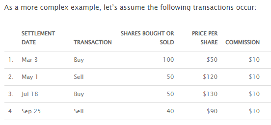

We first generate the data:

``` r
library(cryptoTax)
data <- data_adjustedcostbase1
data
```

| date       | transaction | quantity | price | fees |
|:-----------|:------------|---------:|------:|-----:|
| 2014-03-03 | buy         |      100 |    50 |   10 |
| 2014-05-01 | sell        |       50 |   120 |   10 |
| 2014-07-18 | buy         |       50 |   130 |   10 |
| 2014-09-25 | sell        |       40 |    90 |   10 |

Next, we generate the calculations to achieve the following result:

> 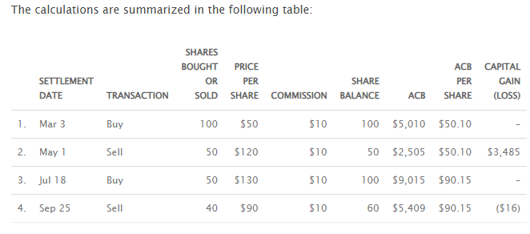

``` r
ACB(data, spot.rate = "price", sup.loss = FALSE)
```

| date       | transaction | quantity | price | fees | total.price | total.quantity |  ACB | ACB.share | gains |
|:-----------|:------------|---------:|------:|-----:|------------:|---------------:|-----:|----------:|------:|
| 2014-03-03 | buy         |      100 |    50 |   10 |        5000 |            100 | 5010 |     50.10 |    NA |
| 2014-05-01 | sell        |       50 |   120 |   10 |        6000 |             50 | 2505 |     50.10 |  3485 |
| 2014-07-18 | buy         |       50 |   130 |   10 |        6500 |            100 | 9015 |     90.15 |    NA |
| 2014-09-25 | sell        |       40 |    90 |   10 |        3600 |             60 | 5409 |     90.15 |   -16 |

## Superficial losses

We will now replicate the more advanced superficial loss example
showcased at
<https://www.adjustedcostbase.ca/blog/what-is-the-superficial-loss-rule/>.

### Example 1

We first demonstrate the “Violation of the Superficial Loss Rule” by
using regular ACB *without* accounting for superficial losses:

> 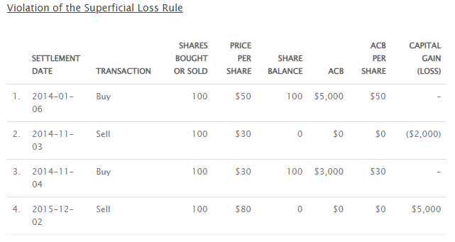

``` r
data <- data_adjustedcostbase2
ACB(data, spot.rate = "price", sup.loss = FALSE)
```

| date       | transaction | quantity | price | total.price | fees | total.quantity |  ACB | ACB.share | gains |
|:-----------|:------------|---------:|------:|------------:|-----:|---------------:|-----:|----------:|------:|
| 2014-01-06 | buy         |      100 |    50 |        5000 |    0 |            100 | 5000 |        50 |    NA |
| 2014-11-03 | sell        |      100 |    30 |        3000 |    0 |              0 |    0 |         0 | -2000 |
| 2014-11-04 | buy         |      100 |    30 |        3000 |    0 |            100 | 3000 |        30 |    NA |
| 2015-12-02 | sell        |      100 |    80 |        8000 |    0 |              0 |    0 |         0 |  5000 |

Next, we do it the correct way, *accounting* for superficial losses:

> 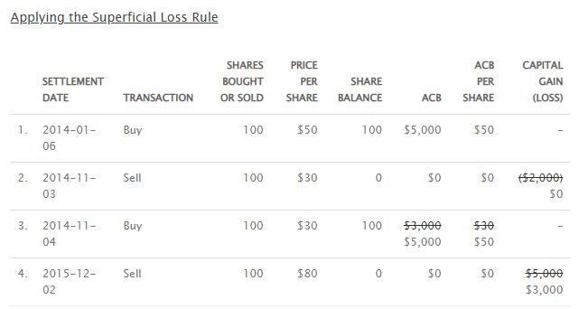

Per default, setting `sup.loss = TRUE` (the default) generates a lot of
columns to provide as much information as possible. To make it look as
short as the adjustedcostbase.ca example, we can subselect relevant
columns:

``` r
library(dplyr)
ACB(data, spot.rate = "price") %>%
  select(date, transaction, quantity, price, total.quantity, ACB, ACB.share, gains)
```

| date       | transaction | quantity | price | total.quantity |  ACB | ACB.share | gains |
|:-----------|:------------|---------:|------:|---------------:|-----:|----------:|------:|
| 2014-01-06 | buy         |      100 |    50 |            100 | 5000 |        50 |    NA |
| 2014-11-03 | sell        |      100 |    30 |              0 |    0 |         0 |    NA |
| 2014-11-04 | buy         |      100 |    30 |            100 | 5000 |        50 |    NA |
| 2015-12-02 | sell        |      100 |    80 |              0 |    0 |         0 |  3000 |

### Example 2

We continue with the second superficial loss example. We first
demonstrate the “Violation of the Superficial Loss Rule” by using
regular ACB *without* accounting for superficial losses:

> 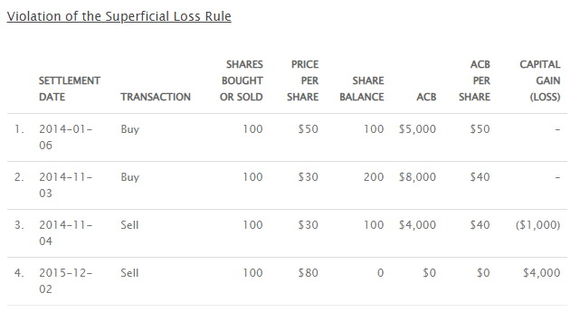

``` r
data <- data_adjustedcostbase3
ACB(data, spot.rate = "price", sup.loss = FALSE)
```

| date       | transaction | quantity | price | total.price | fees | total.quantity |  ACB | ACB.share | gains |
|:-----------|:------------|---------:|------:|------------:|-----:|---------------:|-----:|----------:|------:|
| 2014-01-06 | buy         |      100 |    50 |        5000 |    0 |            100 | 5000 |        50 |    NA |
| 2014-11-03 | buy         |      100 |    30 |        3000 |    0 |            200 | 8000 |        40 |    NA |
| 2014-11-04 | sell        |      100 |    30 |        3000 |    0 |            100 | 4000 |        40 | -1000 |
| 2015-12-02 | sell        |      100 |    80 |        8000 |    0 |              0 |    0 |         0 |  4000 |

Next, we do it the correct way, *accounting* for superficial losses:

> 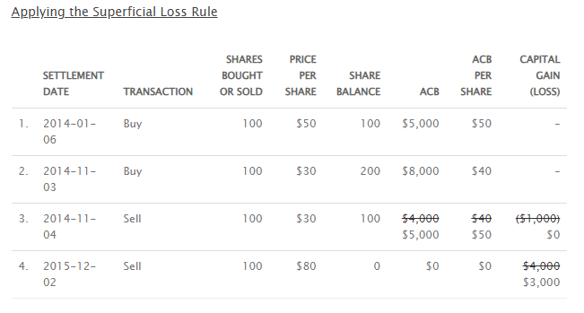

``` r
ACB(data, spot.rate = "price") %>%
  select(date, transaction, quantity, price, total.quantity, ACB, ACB.share, gains)
```

| date       | transaction | quantity | price | total.quantity |  ACB | ACB.share | gains |
|:-----------|:------------|---------:|------:|---------------:|-----:|----------:|------:|
| 2014-01-06 | buy         |      100 |    50 |            100 | 5000 |        50 |    NA |
| 2014-11-03 | buy         |      100 |    30 |            200 | 8000 |        40 |    NA |
| 2014-11-04 | sell        |      100 |    30 |            100 | 5000 |        50 |    NA |
| 2015-12-02 | sell        |      100 |    80 |              0 |    0 |         0 |  3000 |

### Example 3

We continue with the third superficial loss example (first example in
<https://www.adjustedcostbase.ca/blog/applying-the-superficial-loss-rule-for-a-partial-disposition-of-shares/>).
We first demonstrate the “Violation of the Superficial Loss Rule” by
using regular ACB *without* accounting for superficial losses:

#### When Shares are Sold at a Loss and then Partially Reacquired within the Superficial Loss Period

> 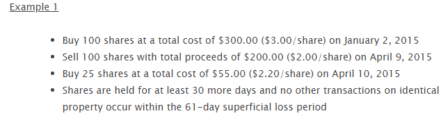

``` r
data <- data_adjustedcostbase4
ACB(data, spot.rate = "price", sup.loss = FALSE)
```

| date       | transaction | quantity | price | total.price | fees | total.quantity | ACB | ACB.share | gains |
|:-----------|:------------|---------:|------:|------------:|-----:|---------------:|----:|----------:|------:|
| 2015-01-02 | buy         |      100 |   3.0 |         300 |    0 |            100 | 300 |       3.0 |    NA |
| 2015-04-09 | sell        |      100 |   2.0 |         200 |    0 |              0 |   0 |       0.0 |  -100 |
| 2015-04-10 | buy         |       25 |   2.2 |          55 |    0 |             25 |  55 |       2.2 |    NA |

Next, we do it the correct way, *accounting* for superficial losses:

> 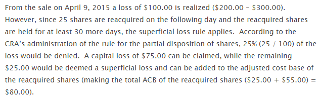

``` r
ACB(data, spot.rate = "price") %>%
  select(date, transaction, quantity, price, total.quantity, ACB, ACB.share, gains)
```

| date       | transaction | quantity | price | total.quantity | ACB | ACB.share | gains |
|:-----------|:------------|---------:|------:|---------------:|----:|----------:|------:|
| 2015-01-02 | buy         |      100 |   3.0 |            100 | 300 |       3.0 |    NA |
| 2015-04-09 | sell        |      100 |   2.0 |              0 |   0 |       0.0 |   -75 |
| 2015-04-10 | buy         |       25 |   2.2 |             25 |  80 |       3.2 |    NA |

### Example 4

We continue with the fourth superficial loss example (second example in
<https://www.adjustedcostbase.ca/blog/applying-the-superficial-loss-rule-for-a-partial-disposition-of-shares/>).
We first demonstrate the “Violation of the Superficial Loss Rule” by
using regular ACB *without* accounting for superficial losses:

#### When Shares are Purchased and then Partially Sold within the Superficial Loss Period

> 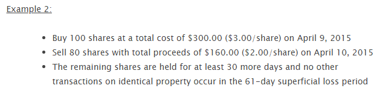

``` r
data <- data_adjustedcostbase5
ACB(data, spot.rate = "price", sup.loss = FALSE)
```

| date       | transaction | quantity | price | total.price | fees | total.quantity | ACB | ACB.share | gains |
|:-----------|:------------|---------:|------:|------------:|-----:|---------------:|----:|----------:|------:|
| 2015-04-09 | buy         |      100 |     3 |         300 |    0 |            100 | 300 |         3 |    NA |
| 2015-04-10 | sell        |       80 |     2 |         160 |    0 |             20 |  60 |         3 |   -80 |

Next, we do it the correct way, *accounting* for superficial losses:

> 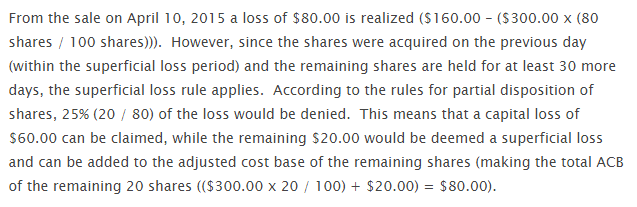

``` r
ACB(data, spot.rate = "price") %>%
  select(date, transaction, quantity, price, total.quantity, ACB, ACB.share, gains)
```

| date       | transaction | quantity | price | total.quantity | ACB | ACB.share | gains |
|:-----------|:------------|---------:|------:|---------------:|----:|----------:|------:|
| 2015-04-09 | buy         |      100 |     3 |            100 | 300 |         3 |    NA |
| 2015-04-10 | sell        |       80 |     2 |             20 |  80 |         4 |   -60 |

### Example 5

#### When Multiple Acquisitions and/or Multiple Dispositions Occur Within the Superficial Loss Period

There are no examples given for this one, so we make our own.
adjustedcostbase.ca writes that the web-based application does not
support claiming partial losses automatically:

> Note that AdjustedCostBase.ca does not automatically apply the
> superficial loss rule for you. Although you’ll see superficial loss
> rule warnings being displayed in many cases, it’s up to you to edit
> the transaction to apply the superficial loss rule. Also, in cases
> where you’re partially claiming a loss due to the superficial loss
> rule, you’ll need to manually calculate the partial capital loss using
> the methods described above.

Fortunately, `cryptoTax` allows claiming partial losses automatically.
We first demonstrate the “Violation of the Superficial Loss Rule” by
using regular ACB *without* accounting for superficial losses:

``` r
data <- data_adjustedcostbase6
ACB(data, spot.rate = "price", sup.loss = FALSE)
```

| date       | transaction | quantity | price | total.price | fees | total.quantity | ACB | ACB.share | gains |
|:-----------|:------------|---------:|------:|------------:|-----:|---------------:|----:|----------:|------:|
| 2015-04-09 | buy         |      150 |     3 |         450 |    0 |            150 | 450 |         3 |    NA |
| 2015-04-10 | sell        |       20 |     2 |          40 |    0 |            130 | 390 |         3 |   -20 |
| 2015-04-15 | buy         |       50 |     3 |         150 |    0 |            180 | 540 |         3 |    NA |
| 2015-04-20 | sell        |       10 |     2 |          20 |    0 |            170 | 510 |         3 |   -10 |
| 2015-05-15 | sell        |       80 |     2 |         160 |    0 |             90 | 270 |         3 |   -80 |

Next, we do it the correct way, *accounting* for superficial losses, and
include a few more columns for the demonstration:

``` r
ACB(data, spot.rate = "price") %>%
  select(
    date, transaction, quantity, price, total.quantity,
    suploss.range, sup.loss, sup.loss.quantity, ACB, ACB.share,
    gains.uncorrected, gains.sup, gains.excess, gains
  )
```

| date       | transaction | quantity | price | total.quantity |                 suploss.range | sup.loss | sup.loss.quantity |      ACB | ACB.share | gains.uncorrected | gains.sup | gains.excess |     gains |
|:-----------|:------------|---------:|------:|---------------:|------------------------------:|:---------|------------------:|---------:|----------:|------------------:|----------:|-------------:|----------:|
| 2015-04-09 | buy         |      150 |     3 |            150 | 2015-03-10 UTC–2015-05-09 UTC | FALSE    |                 0 | 450.0000 |  3.000000 |           0.00000 |        NA |           NA |        NA |
| 2015-04-10 | sell        |       20 |     2 |            130 | 2015-03-11 UTC–2015-05-10 UTC | TRUE     |                20 | 410.0000 |  3.153846 |         -20.00000 | -20.00000 |           NA |        NA |
| 2015-04-15 | buy         |       50 |     3 |            180 | 2015-03-16 UTC–2015-05-15 UTC | FALSE    |                 0 | 580.0000 |  3.222222 |           0.00000 |        NA |           NA |        NA |
| 2015-04-20 | sell        |       10 |     2 |            170 | 2015-03-21 UTC–2015-05-20 UTC | TRUE     |                10 | 560.0000 |  3.294118 |         -12.22222 | -12.22222 |           NA |        NA |
| 2015-05-15 | sell        |       80 |     2 |             90 | 2015-04-15 UTC–2015-06-14 UTC | TRUE     |                80 | 361.1765 |  4.013072 |        -103.52941 | -64.70588 |    -38.82353 | -38.82353 |

## Other examples from the internet

### CryptoTaxCalculator

#### Example 1

Here is an example from CryptoTaxCalculator, showcased at:
<https://cryptotaxcalculator.io/guides/crypto-tax-canada-cra/>. We first
demonstrate the “Violation of the Superficial Loss Rule” by using
regular ACB *without* accounting for superficial losses:

> 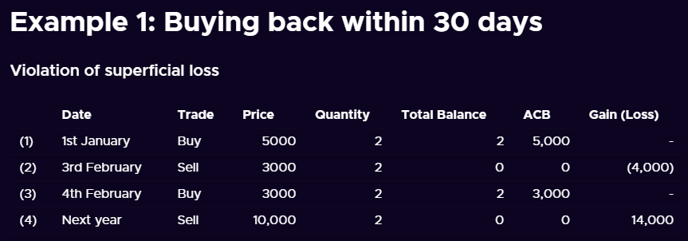

``` r
data <- data_cryptotaxcalculator1
ACB(data, transaction = "trade", spot.rate = "price", sup.loss = FALSE)
```

| date       | trade | currency | price | quantity | total.price | fees | total.quantity |   ACB | ACB.share | gains |
|:-----------|:------|:---------|------:|---------:|------------:|-----:|---------------:|------:|----------:|------:|
| 2020-01-01 | buy   | BTC      |  5000 |        2 |       10000 |    0 |              2 | 10000 |      5000 |    NA |
| 2020-02-03 | sell  | BTC      |  3000 |        2 |        6000 |    0 |              0 |     0 |         0 | -4000 |
| 2020-02-04 | buy   | BTC      |  3000 |        2 |        6000 |    0 |              2 |  6000 |      3000 |    NA |
| 2021-02-04 | sell  | BTC      | 10000 |        2 |       20000 |    0 |              0 |     0 |         0 | 14000 |

Next, we do it the correct way, *accounting* for superficial losses:

> 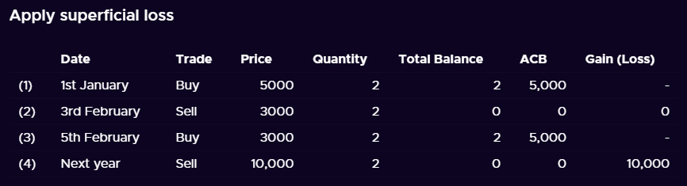

``` r
ACB(data, transaction = "trade", spot.rate = "price") %>%
  select(date, trade, price, quantity, total.quantity, ACB, ACB.share, gains)
```

| date       | trade | price | quantity | total.quantity |   ACB | ACB.share | gains |
|:-----------|:------|------:|---------:|---------------:|------:|----------:|------:|
| 2020-01-01 | buy   |  5000 |        2 |              2 | 10000 |      5000 |    NA |
| 2020-02-03 | sell  |  3000 |        2 |              0 |     0 |         0 |    NA |
| 2020-02-04 | buy   |  3000 |        2 |              2 | 10000 |      5000 |    NA |
| 2021-02-04 | sell  | 10000 |        2 |              0 |     0 |         0 | 10000 |

#### Example 2

We continue with the second superficial loss example. We first
demonstrate the “Violation of the Superficial Loss Rule” by using
regular ACB *without* accounting for superficial losses:

> 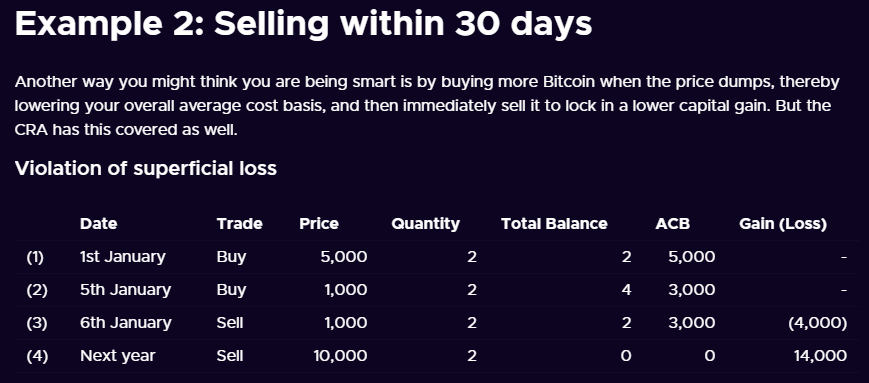

``` r
data <- data_cryptotaxcalculator2
ACB(data, transaction = "trade", spot.rate = "price", sup.loss = FALSE)
```

| date       | trade | currency | price | quantity | total.price | fees | total.quantity |   ACB | ACB.share | gains |
|:-----------|:------|:---------|------:|---------:|------------:|-----:|---------------:|------:|----------:|------:|
| 2020-01-01 | buy   | BTC      |  5000 |        2 |       10000 |    0 |              2 | 10000 |      5000 |    NA |
| 2020-02-05 | buy   | BTC      |  1000 |        2 |        2000 |    0 |              4 | 12000 |      3000 |    NA |
| 2020-02-06 | sell  | BTC      |  1000 |        2 |        2000 |    0 |              2 |  6000 |      3000 | -4000 |
| 2021-02-06 | sell  | BTC      | 10000 |        2 |       20000 |    0 |              0 |     0 |         0 | 14000 |

Next, we do it the correct way, *accounting* for superficial losses:

> 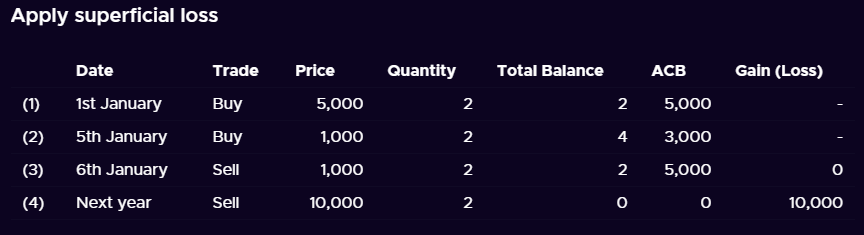

``` r
ACB(data, transaction = "trade", spot.rate = "price") %>%
  select(date, trade, price, quantity, total.quantity, ACB, ACB.share, gains)
```

| date       | trade | price | quantity | total.quantity |   ACB | ACB.share | gains |
|:-----------|:------|------:|---------:|---------------:|------:|----------:|------:|
| 2020-01-01 | buy   |  5000 |        2 |              2 | 10000 |      5000 |    NA |
| 2020-02-05 | buy   |  1000 |        2 |              4 | 12000 |      3000 |    NA |
| 2020-02-06 | sell  |  1000 |        2 |              2 | 10000 |      5000 |    NA |
| 2021-02-06 | sell  | 10000 |        2 |              0 |     0 |         0 | 10000 |

### Coinpanda

#### Example 1

Here is an example from Coinpanda, showcased at:
<https://coinpanda.io/blog/crypto-taxes-canada-adjusted-cost-base/>. The
first example does not require the superficial loss rule so we can set
it to `FALSE` without worry.

> 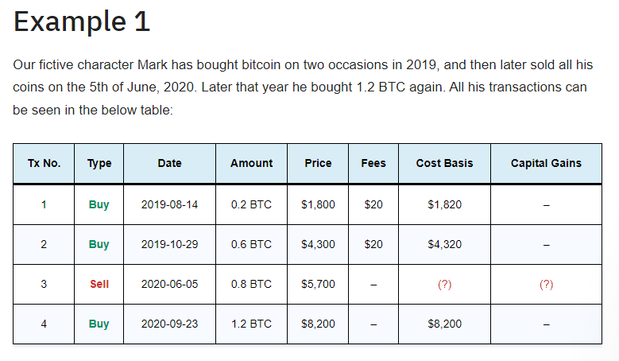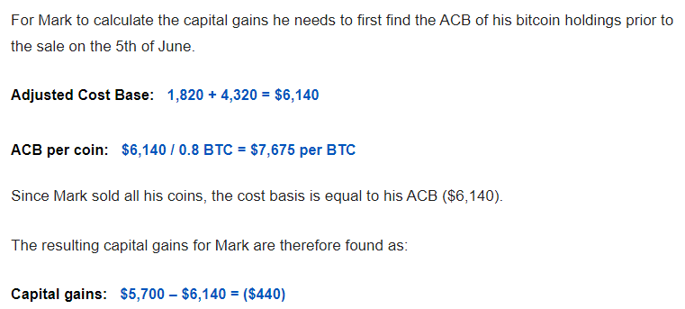

``` r
data <- data_coinpanda1
ACB(data,
  transaction = "type", quantity = "amount",
  total.price = "price", sup.loss = FALSE
)
```

| type | date       | currency | amount | price | fees | total.quantity |  ACB | ACB.share | gains |
|:-----|:-----------|:---------|-------:|------:|-----:|---------------:|-----:|----------:|------:|
| buy  | 2019-08-14 | BTC      |    0.2 |  1800 |   20 |            0.2 | 1820 |  9100.000 |    NA |
| buy  | 2019-10-29 | BTC      |    0.6 |  4300 |   20 |            0.8 | 6140 |  7675.000 |    NA |
| sell | 2020-06-05 | BTC      |    0.8 |  5700 |    0 |            0.0 |    0 |     0.000 |  -440 |
| buy  | 2020-09-23 | BTC      |    1.2 |  8200 |    0 |            1.2 | 8200 |  6833.333 |    NA |

#### Example 2

We continue with the second superficial loss example. We first
demonstrate the “Violation of the Superficial Loss Rule” by using
regular ACB *without* accounting for superficial losses:

> 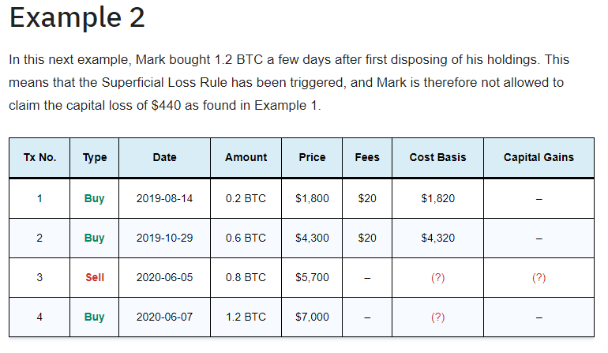

``` r
data <- data_coinpanda2
ACB(data,
  transaction = "type", quantity = "amount",
  total.price = "price", sup.loss = FALSE
)
```

| type | date       | currency | amount | price | fees | total.quantity |  ACB | ACB.share | gains |
|:-----|:-----------|:---------|-------:|------:|-----:|---------------:|-----:|----------:|------:|
| buy  | 2019-08-14 | BTC      |    0.2 |  1800 |   20 |            0.2 | 1820 |  9100.000 |    NA |
| buy  | 2019-10-29 | BTC      |    0.6 |  4300 |   20 |            0.8 | 6140 |  7675.000 |    NA |
| sell | 2020-06-05 | BTC      |    0.8 |  5700 |    0 |            0.0 |    0 |     0.000 |  -440 |
| buy  | 2020-06-07 | BTC      |    1.2 |  7000 |    0 |            1.2 | 7000 |  5833.333 |    NA |

Next, we do it the correct way, *accounting* for superficial losses:

> 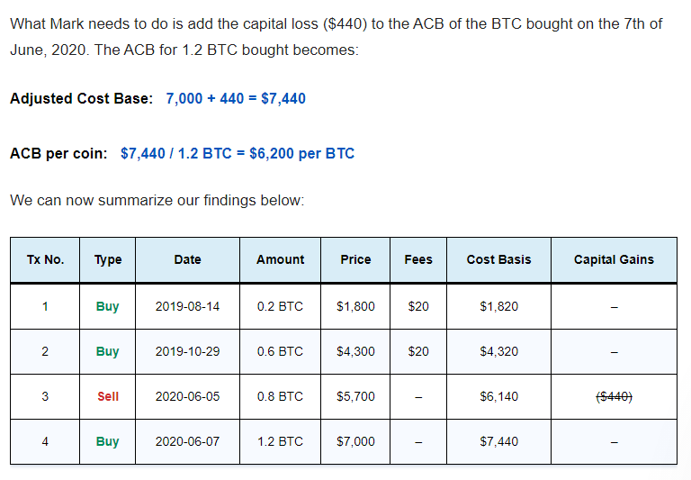

``` r
ACB(data, transaction = "type", quantity = "amount", total.price = "price") %>%
  select(type, date, amount, price, fees, ACB, ACB.share, gains)
```

| type | date       | amount | price | fees |  ACB | ACB.share | gains |
|:-----|:-----------|-------:|------:|-----:|-----:|----------:|:------|
| buy  | 2019-08-14 |    0.2 |  1800 |   20 | 1820 |      9100 | NA    |
| buy  | 2019-10-29 |    0.6 |  4300 |   20 | 6140 |      7675 | NA    |
| sell | 2020-06-05 |    0.8 |  5700 |    0 |    0 |         0 | NA    |
| buy  | 2020-06-07 |    1.2 |  7000 |    0 | 7440 |      6200 | NA    |

### Koinly

Here is an example from Koinly, showcased at:
<https://koinly.io/blog/calculating-crypto-taxes-canada/>. We first
demonstrate the “Violation of the Superficial Loss Rule” by using
regular ACB *without* accounting for superficial losses:

> 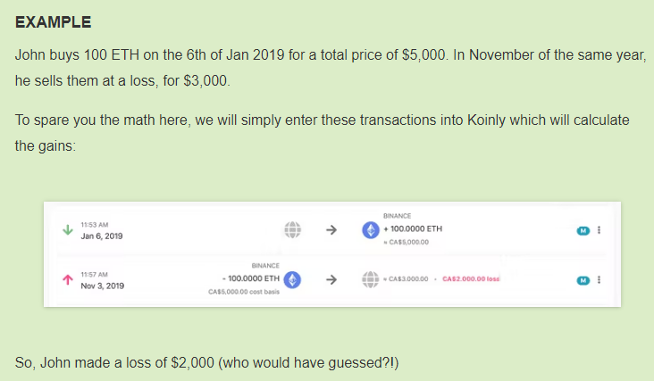

``` r
data <- data_koinly
ACB(data, sup.loss = FALSE)
```

| date       | transaction | currency | quantity | spot.rate | total.price | fees | total.quantity |  ACB | ACB.share | gains |
|:-----------|:------------|:---------|---------:|----------:|------------:|-----:|---------------:|-----:|----------:|------:|
| 2019-01-06 | buy         | ETH      |      100 |        50 |        5000 |    0 |            100 | 5000 |        50 |    NA |
| 2019-11-03 | sell        | ETH      |      100 |        30 |        3000 |    0 |              0 |    0 |         0 | -2000 |
| 2019-11-04 | buy         | ETH      |      100 |        30 |        3000 |    0 |            100 | 3000 |        30 |    NA |

Next, we do it the correct way, *accounting* for superficial losses:

> 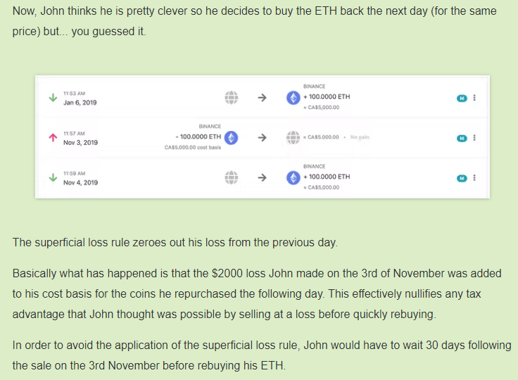

``` r
ACB(data) %>%
  select(date, transaction, quantity, spot.rate, total.quantity, ACB, ACB.share, gains)
```

| date       | transaction | quantity | spot.rate | total.quantity |  ACB | ACB.share | gains |
|:-----------|:------------|---------:|----------:|---------------:|-----:|----------:|:------|
| 2019-01-06 | buy         |      100 |        50 |            100 | 5000 |        50 | NA    |
| 2019-11-03 | sell        |      100 |        30 |              0 |    0 |         0 | NA    |
| 2019-11-04 | buy         |      100 |        30 |            100 | 5000 |        50 | NA    |
