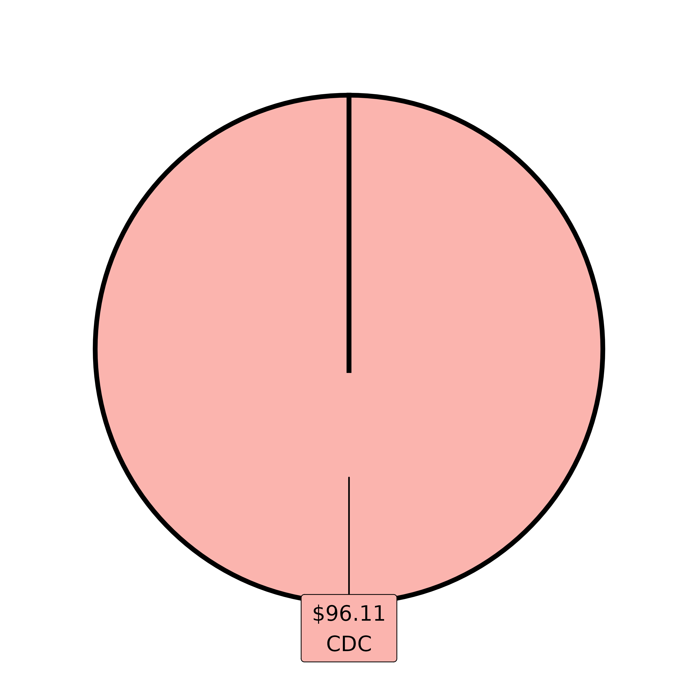
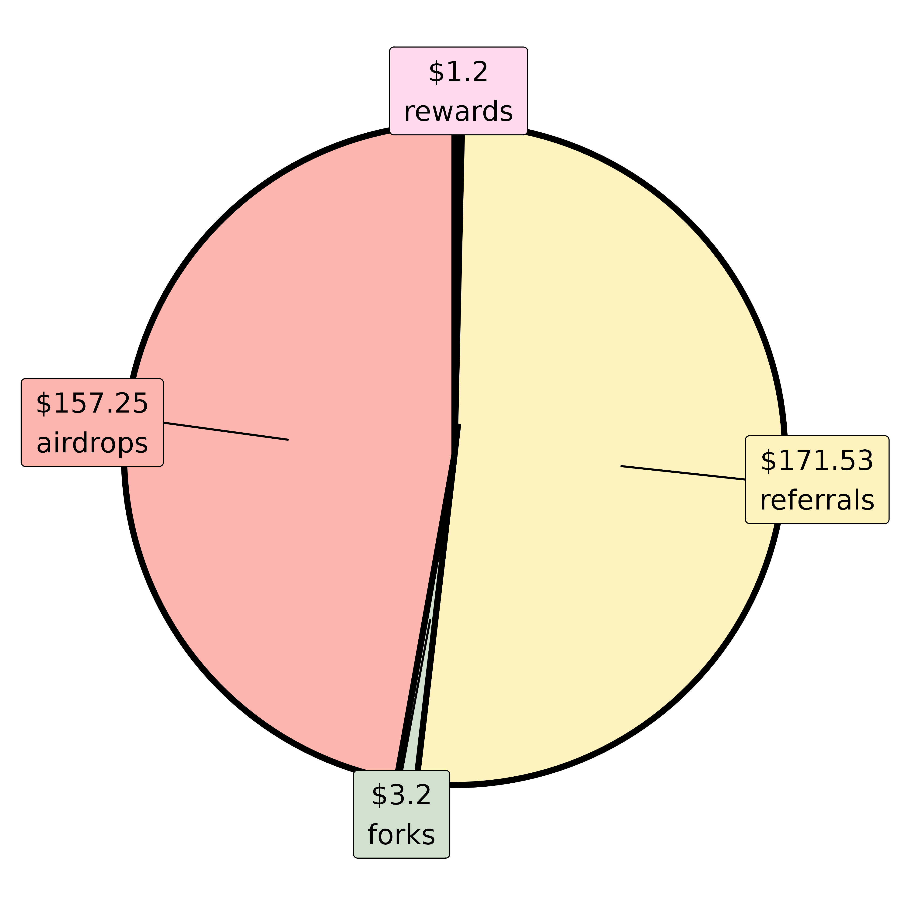

# Generate a Full Tax Report

It is possible to generate a full tax report with `cryptoTax`. This
vignette shows how.

To keep the workflow reproducible and easy to run without internet
access, the examples below use the built-in `list_prices_example`
fixture.

For real tax work across multiple sessions, a more practical workflow is
often to save your prepared `list.prices` object to disk, reload it
later, and then optionally seed the package cache with
[`add_to_cache()`](https://cryptoltruist.github.io/cryptoTax/reference/add_to_cache.md)
for same-session convenience.

## Preparing your list of coins

First, you want price information for all your coins.

> *Note*: Some exchanges don’t require external pricing for their raw
> formatting because they already include CAD values. However, price
> data is still useful for current-value reporting, and therefore your
> unrealized gains and losses.

``` r
library(cryptoTax)

if (file.exists("list.prices.rds")) {
  list.prices <- readRDS("list.prices.rds")
} else {
  list.prices <- prepare_list_prices(
    my.coins,
    start.date = "2021-02-01"
  )
  saveRDS(list.prices, "list.prices.rds")
}

# Optional: make the saved object available through the package cache during
# this R session so formatters can reuse it implicitly if desired.
add_to_cache(list.prices = list.prices)
```

## Formatting your data

Below we use
[`format_exchanges()`](https://cryptoltruist.github.io/cryptoTax/reference/format_exchanges.md)
to format all exchanges in one step. Under the hood it uses
[`format_detect()`](https://cryptoltruist.github.io/cryptoTax/reference/format_detect.md)
and also accepts nested lists, empty files, or already formatted
transaction tables if needed.

``` r
exchanges <- list(
  data_adalite, data_binance, data_binance_withdrawals, data_blockfi, data_CDC,
  data_CDC_exchange_rewards, data_CDC_exchange_trades, data_CDC_wallet, data_celsius,
  data_coinsmart, data_exodus, data_gemini, data_newton, data_pooltool, data_presearch,
  data_shakepay, data_uphold
)

formatted.data <- format_exchanges(exchanges, list.prices = list.prices)
```

If you prefer a maximally audit-friendly workflow, it is also completely
fine to format each exchange explicitly, inspect the output, and only
then merge everything:

``` r
x.adalite <- format_adalite(data_adalite, list.prices = list.prices)
x.binance <- format_binance(data_binance, list.prices = list.prices)
x.binance.withdrawals <- format_binance_withdrawals(
  data_binance_withdrawals,
  list.prices = list.prices
)
x.cdc <- format_CDC(data_CDC)
x.gemini <- format_gemini(data_gemini, list.prices = list.prices)

formatted.data <- merge_exchanges(
  x.adalite,
  x.binance,
  x.binance.withdrawals,
  x.cdc,
  x.gemini
)
```

## Adjusted Cost Base

Next, we can begin processing that data. We start by formatting the
[Adjusted Cost Base
(ACB)](https://cryptoltruist.github.io/cryptoTax/articles/ACB.html) of
each transaction. The `formatted.ACB` is going to be our core object
with which we will be working for all future steps.

``` r
formatted.ACB <- format_ACB(formatted.data)
#> Process started at 2026-04-20 00:54:29.573008. Please be patient as the transactions process.
#> [Formatting ACB (progress bar repeats for each coin)...]
#> Note: Adjusted cost base (ACB) and capital gains have been adjusted for the superficial loss rule. To avoid this, use argument `sup.loss = FALSE`.
#> Process ended at 2026-04-20 00:54:29.91854. Total time elapsed: 0.01 minutes
```

> Per default,
> [`format_ACB()`](https://cryptoltruist.github.io/cryptoTax/reference/format_ACB.md)
> considers taxable revenue (and not aquisition at \$0 ACB) the
> following transaction types: staking, interests, and mining. If you
> want a different treatment for those transactions (or other types of
> revenues like cashback and airdrops), use the `as.revenue` argument of
> [`format_ACB()`](https://cryptoltruist.github.io/cryptoTax/reference/format_ACB.md).

We get a warning that there are negative values in some places,
therefore that we might have forgotten some transactions. The
[`check_missing_transactions()`](https://cryptoltruist.github.io/cryptoTax/reference/check_missing_transactions.md)
function makes it easy to identify which transactions (and therefore
which coin) are concerned with this.

``` r
check_missing_transactions(formatted.ACB)
#> # A tibble: 3 × 28
#> # Groups:   currency [11]
#>   date                currency quantity total.price spot.rate transaction  fees
#>   <dttm>              <chr>       <dbl>       <dbl>     <dbl> <chr>       <dbl>
#> 1 2021-03-07 21:46:57 BAT         52.6        38.5      0.733 sell            0
#> 2 2021-04-05 12:22:00 BAT          8.52        0        0.994 revenue         0
#> 3 2021-04-06 04:47:00 BAT          8.52        5.92     0.695 sell            0
#> # ℹ 21 more variables: description <chr>, comment <chr>, revenue.type <chr>,
#> #   value <dbl>, exchange <chr>, rate.source <chr>, fees.quantity <dbl>,
#> #   fees.currency <chr>, currency2 <chr>, total.quantity <dbl>,
#> #   suploss.range <Interval>, quantity.60days <dbl>, share.left60 <dbl>,
#> #   sup.loss.quantity <dbl>, sup.loss <lgl>, gains.uncorrected <dbl>,
#> #   gains.sup <dbl>, gains.excess <lgl>, gains <dbl>, ACB <dbl>,
#> #   ACB.share <dbl>
```

Next, we might want to make sure that we have downloaded the latest
files for each exchange. If you shake your phone every day for sats, or
you receive daily weekly payments from staking, you would expect the
latest date to be recent. For this we use the
[`get_latest_transactions()`](https://cryptoltruist.github.io/cryptoTax/reference/get_latest_transactions.md)
function.

``` r
get_latest_transactions(formatted.ACB)
#> # A tibble: 14 × 2
#> # Groups:   exchange [14]
#>    exchange     date               
#>    <chr>        <dttm>             
#>  1 CDC          2021-07-28 23:23:04
#>  2 CDC.exchange 2021-12-24 15:34:45
#>  3 CDC.wallet   2021-06-26 14:51:02
#>  4 adalite      2021-05-17 21:31:00
#>  5 binance      2022-11-27 08:05:35
#>  6 blockfi      2021-10-24 04:29:23
#>  7 celsius      2021-05-23 05:00:00
#>  8 coinsmart    2021-06-03 02:04:49
#>  9 exodus       2021-06-12 22:31:35
#> 10 gemini       2021-06-18 01:38:54
#> 11 newton       2021-06-16 18:49:11
#> 12 presearch    2021-12-09 06:24:22
#> 13 shakepay     2021-07-10 00:52:19
#> 14 uphold       2021-06-09 04:52:23
```

At this stage, it is possible to list transactions by coin, if you have
few transactions. The output can be very long as soon as you have many
transactions however, so we will not be showing it here, but you can
have a look at the
[`listby_coin()`](https://cryptoltruist.github.io/cryptoTax/reference/listby_coin.md)
function and its example.

## Full Tax Report

Next, we need to calculate a few extra bits of information for the final
report. Fortunately, the
[`prepare_report()`](https://cryptoltruist.github.io/cryptoTax/reference/prepare_report.md)
function makes this easy for us.

``` r
report.info <- prepare_report(formatted.ACB,
  tax.year = 2021,
  local.timezone = "America/Toronto",
  list.prices = list.prices
)
```

The `report.info` object is a list containing all the different info
(tables, figures) necessary for the final report. They can be accessed
individually too:

``` r
names(report.info)
#>  [1] "report.overview"    "report.summary"     "proceeds"          
#>  [4] "sup.losses"         "table.revenues"     "tax.box"           
#>  [7] "pie_exchange"       "pie_revenue"        "current.price.date"
#> [10] "local.timezone"
```

Finally, to generate the report, we use
[`print_report()`](https://cryptoltruist.github.io/cryptoTax/reference/print_report.md)
with the relevant information:

``` r
print_report(formatted.ACB,
  list.prices = list.prices,
  tax.year = "2021",
  name = "Mr. Cryptoltruist",
  local.timezone = "America/Toronto"
)
```

------------------------------------------------------------------------

## Full Crypto Tax Report for Tax Year 2021

Name: Mr. Cryptoltruist

Date: Mon Apr 20 00:54:31 2026

#### Summary

| Type                | Amount    | currency |
|---------------------|-----------|----------|
| gains               | 3,970.20  | CAD      |
| losses              | 0.00      | CAD      |
| net                 | 3,970.20  | CAD      |
| total.cost          | 7,887.31  | CAD      |
| value.today         | 17,316.13 | CAD      |
| unrealized.gains    | 9,428.82  | CAD      |
| unrealized.losses   | 0.00      | CAD      |
| unrealized.net      | 9,428.82  | CAD      |
| percentage.up       | 119.54%   | CAD      |
| all.time.up         | 169.88%   | CAD      |
| all.time.up.revenue | 176.23%   | CAD      |
| revenue             | 500.46    | CAD      |

    #> Warning: Date of value.today: 2023-12-31

#### Overview

| date.last           | currency | total.quantity | cost.share | total.cost | net      | currency2 |
|---------------------|----------|----------------|------------|------------|----------|-----------|
| 2021-12-24 15:34:45 | CRO      | 19,234.2928403 | 0.32       | 6,226.49   | 0.00     | CRO       |
| 2021-10-24 04:29:23 | LTC      | 5.5542096      | 172.64     | 958.90     | 1,554.59 | LTC       |
| 2021-12-24 15:34:45 | ETH      | 0.0761972      | 1,569.90   | 119.62     | 2,254.32 | ETH       |
| 2021-08-07 21:43:44 | BTC      | 0.0048642      | 29,138.16  | 141.73     | 116.59   | BTC       |
| 2021-06-06 22:14:11 | ADA      | 209.0297373    | 1.23       | 256.29     | 0.23     | ADA       |
| 2021-06-18 01:38:54 | BAT      | 29.6939758     | 1.64       | 48.62      | 44.47    | BAT       |
| 2021-12-09 06:24:22 | PRE      | 3,010.00       | 0.02       | 62.60      | 0.00     | PRE       |
| 2022-11-27 08:05:35 | USDC     | 49.2669990     | 1.26       | 62.31      | 0.00     | USDC      |
| 2022-11-27 08:05:35 | BUSD     | 5.8763653      | 1.28       | 7.55       | 0.00     | BUSD      |
| 2022-11-17 11:54:25 | ETHW     | 0.3559272      | 9.00       | 3.20       | 0.00     | ETHW      |
| 2022-11-27 08:05:35 | Total    |                |            | 7,887.31   | 3,970.20 | Total     |

#### Current Value

| currency | cost.share | total.cost | rate.today | value.today | unrealized.gains | unrealized.losses | unrealized.net | currency2 |
|----------|------------|------------|------------|-------------|------------------|-------------------|----------------|-----------|
| CRO      | 0.32       | 6,226.49   | 0.70       | 13,406.30   | 7,179.81         |                   | 7,179.81       | CRO       |
| LTC      | 172.64     | 958.90     | 314.10     | 1,744.58    | 785.68           |                   | 785.68         | LTC       |
| ADA      | 1.23       | 256.29     | 3.39       | 708.19      | 451.90           |                   | 451.90         | ADA       |
| PRE      | 0.02       | 62.60      | 0.16       | 479.79      | 417.19           |                   | 417.19         | PRE       |
| ETH      | 1,569.90   | 119.62     | 5,629.00   | 428.91      | 309.29           |                   | 309.29         | ETH       |
| BTC      | 29,138.16  | 141.73     | 83,290.00  | 405.14      | 263.41           |                   | 263.41         | BTC       |
| USDC     | 1.26       | 62.31      | 1.30       | 64.28       | 1.97             |                   | 1.97           | USDC      |
| BAT      | 1.64       | 48.62      | 1.99       | 59.21       | 10.59            |                   | 10.59          | BAT       |
| ETHW     | 9.00       | 3.20       | 33.88      | 12.06       | 8.86             |                   | 8.86           | ETHW      |
| BUSD     | 1.28       | 7.55       | 1.30       | 7.67        | 0.12             |                   | 0.12           | BUSD      |
| Total    |            | 7,887.31   |            | 17,316.13   | 9,428.82         | 0                 | 9,428.82       | Total     |
| currency | cost.share | total.cost | rate.today | value.today | unrealized.gains | unrealized.losses | unrealized.net | currency2 |

    #> Warning: Date of value.today: 2023-12-31

#### Superficial losses

| currency | sup.loss |
|----------|----------|

#### Revenues (CAD)

| exchange     | date.last  | total  | interests | rebates | staking | promos | airdrops | referrals | rewards | forks | mining |
|--------------|------------|--------|-----------|---------|---------|--------|----------|-----------|---------|-------|--------|
| celsius      | 2021-05-23 | 164.95 | 3.11      | 0.00    | 0.00    | 111.52 | 0.00     | 50.32     | 0.00    | 0.00  | 0.00   |
| presearch    | 2021-12-09 | 112.54 | 0.00      | 0.00    | 0.00    | 0.00   | 112.54   | 0.00      | 0.00    | 0.00  | 0.00   |
| CDC          | 2021-07-23 | 96.11  | 10.41     | 51.15   | 0.00    | 0.00   | 0.00     | 30.15     | 1.20    | 3.20  | 0.00   |
| newton       | 2021-06-16 | 50.00  | 0.00      | 0.00    | 0.00    | 0.00   | 0.00     | 50.00     | 0.00    | 0.00  | 0.00   |
| blockfi      | 2021-08-07 | 41.62  | 9.06      | 0.00    | 0.00    | 23.22  | 0.00     | 9.34      | 0.00    | 0.00  | 0.00   |
| gemini       | 2021-06-18 | 32.40  | 0.00      | 0.00    | 0.00    | 0.00   | 15.68    | 16.72     | 0.00    | 0.00  | 0.00   |
| uphold       | 2021-06-09 | 23.40  | 0.00      | 0.00    | 0.00    | 0.00   | 23.40    | 0.00      | 0.00    | 0.00  | 0.00   |
| exodus       | 2021-06-06 | 17.26  | 0.00      | 0.00    | 17.26   | 0.00   | 0.00     | 0.00      | 0.00    | 0.00  | 0.00   |
| coinsmart    | 2021-05-15 | 16.99  | 0.00      | 0.00    | 0.00    | 0.00   | 1.99     | 15.00     | 0.00    | 0.00  | 0.00   |
| shakepay     | 2021-06-23 | 3.64   | 0.00      | 0.00    | 0.00    | 0.00   | 3.64     | 0.00      | 0.00    | 0.00  | 0.00   |
| CDC.wallet   | 2021-06-26 | 1.88   | 0.00      | 0.00    | 1.88    | 0.00   | 0.00     | 0.00      | 0.00    | 0.00  | 0.00   |
| adalite      | 2021-05-17 | 1.83   | 0.00      | 0.00    | 1.83    | 0.00   | 0.00     | 0.00      | 0.00    | 0.00  | 0.00   |
| binance      | 2021-11-05 | 1.71   | 0.13      | 1.58    | 0.00    | 0.00   | 0.00     | 0.00      | 0.00    | 0.00  | 0.00   |
| CDC.exchange | 2021-09-07 | 1.13   | 1.10      | 0.02    | 0.00    | 0.00   | 0.00     | 0.00      | 0.00    | 0.00  | 0.00   |
| total        | 2021-12-09 | 565.46 | 23.81     | 52.75   | 20.97   | 134.75 | 157.25   | 171.53    | 1.20    | 3.20  | 0.00   |
| exchange     | date.last  | total  | interests | rebates | staking | promos | airdrops | referrals | rewards | forks | mining |

#### Revenue Sources by **Exchanges**



#### Revenue Sources by **Types**



## Important Tax Information for Your Accountant

  
  

#### Capital gains

Your **capital gains** for 2021 are **\$3,970.20**, whereas your
**capital losses** are **\$0.00** (net = **\$3,970.20**).

> Those are only taxed at 50%. Your **capital losses** are calculated as
> **total capital losses** (**\$**) - **superficial losses** (**\$**) =
> **actual capital losses** (**\$**).

Your total “proceeds” *for the coins you sold at a **profit*** is:
**\$10,069.79** (aggregated for all coins). Your total ACB *for the
coins you sold at a profit* is: **\$6,099.58** (average of all coins).
The difference between the two is your capital gains: **\$3,970.20**.

Your total “proceeds” (adjusted for superficial gains) *for the coins
you sold at a **loss*** is: **\$0.00** (aggregated for all coins). Your
total ACB *for the coins you sold at a loss* is: **\$0.00** (average of
all coins). The difference between the two is your capital losses:
**\$0.00**.

#### Income

Your **total taxable income** from crypto (from interest & staking
exclusively) for 2021 is **\$44.78**, which is considered 100% taxable
income.

> *Note that per default, this amount excludes revenue from credit card
> cashback because it is considered rebate, not income, so considered
> acquired at the fair market value at the time of reception.* The
> income reported above also excludes other forms of airdrops and
> rewards (e.g., from Shakepay, Brave, Presearch), referrals, and
> promos, which are considered acquired at a cost of 0\$ (and will thus
> incur a capital gain of 100% upon selling). Note that should you wish
> to give different tax treatment to the different transaction types,
> you can do so through the ‘as.revenue’ argument of the ‘ACB’ function.
> Mining rewards needs to be labelled individually in the files before
> using
> [`format_ACB()`](https://cryptoltruist.github.io/cryptoTax/reference/format_ACB.md).

#### Total tax estimation

In general, you can expect to pay tax on 50% (**\$1,985.10**) of your
net capital gains + 100% of your taxable income (**\$44.78**), for a
total of **\$2,029.88**. This amount will be taxed based on your tax
bracket.

> Note that if your capital gains are net negative for the current year,
> any excess capital losses can be deferred to following years. However,
> capital losses have to be used in the same year first if you have
> outstanding capital gains.

#### Form T1135

If your **total acquisition cost** has been greater than **\$100,000**
at any point during 2021 (it is **\$7,887.31** at the time of this
report), you will need to fill **form T1135** (*Foreign Income
Verification Statement*). Form T1135 is [available for
download](https://www.canada.ca/en/revenue-agency/services/forms-publications/forms/t1135.html),
and more information about it can be found on the [CRA
website](https://www.canada.ca/en/revenue-agency/services/tax/international-non-residents/information-been-moved/foreign-reporting/questions-answers-about-form-t1135.html).

#### Summary table

Here is a summary of what you need to enter on which lines of your
income tax:

| Description            | Amount    | Comment                                                                    | Line                                          |
|------------------------|-----------|----------------------------------------------------------------------------|-----------------------------------------------|
| Gains proceeds         | 10,069.79 | Proceeds of sold coins (gains)                                             | Schedule 3, line 15199 column 2               |
| Gains ACB              | 6,099.58  | ACB of sold coins (gains)                                                  | Schedule 3, line 15199 column 3               |
| Gains                  | 3,970.20  | Proceeds - ACB (gains)                                                     | Schedule 3, lines 15199 column 5 & 15300      |
| 50% of gains           | 1,985.10  | Half of gains                                                              | T1, line 12700; Schedule 3, line 15300, 19900 |
| Outlays of gains       | 0.00      | Expenses and trading fees (gains). Normally already integrated in the ACB  | Tax software                                  |
| Losses proceeds        | 0.00      | Proceeds of sold coins (losses)                                            | Schedule 3, line 15199 column 2               |
| Losses ACB             | 0.00      | ACB of sold coins (losses)                                                 | Schedule 3, line 15199 column 3               |
| Losses                 | 0.00      | Proceeds - ACB (losses)                                                    | Schedule 3, lines 15199 column 5 & 15300      |
| 50% of losses          | 0.00      | Half of losses                                                             | T1, line 12700; Schedule 3, line 15300, 19900 |
| Outlays of losses      | 0.00      | Expenses and trading fees (losses). Normally already integrated in the ACB | Tax software                                  |
| Foreign income         | 44.78     | Income from crypto interest or staking is considered foreign income        | T1, line 13000, T1135                         |
| Foreign gains (losses) | 3,970.20  | Capital gains from crypto is considered foreign capital gains              | T1135                                         |

#### Other situations

If applicable, you may also need to enter the following:

> Interest expense on money borrowed to purchase investments for the
> purpose of gaining or producing income is tax-deductible. Use line
> 22100 (was line 221) of the personal income tax return, after
> completion of Schedule 4 (federal).

  
  
  
  

……………………………………………………………………………………………………………………………………………………………………………….
